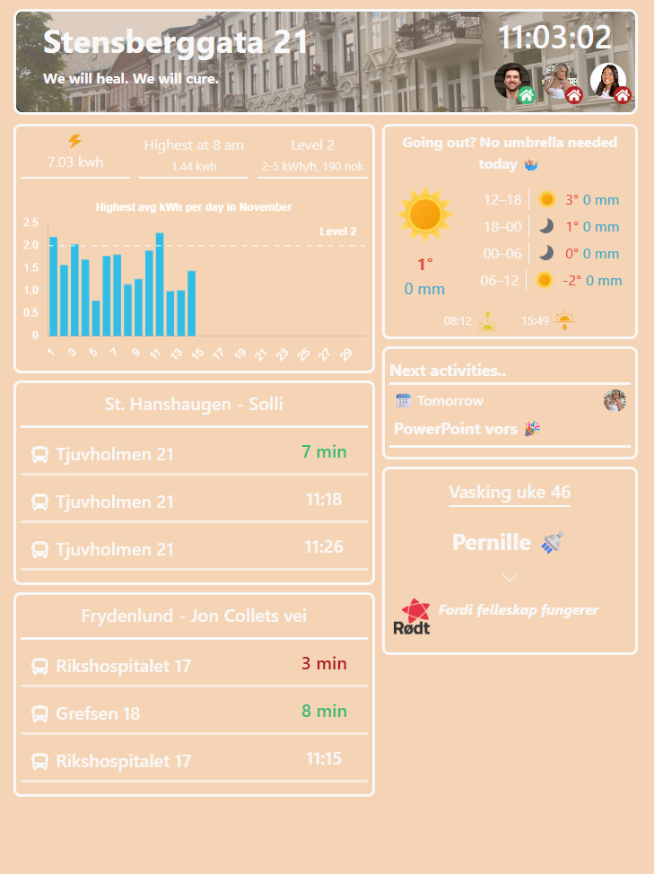

# Heimr

Heimr is a home dashboard that provides useful information about your household and local conditions.

Feel free to contribute.

# Backlog – Heimr

## Bugs
- Broker endpoint have same cache for different posted endpoints

## Improvements
- Weather widget: Change display of umbrella advide
- popup: click outside, await result and configurable buttons
- config file fully configurable
- base class for widget - move div from app.tsx

## Refactors
- Electricity c service computes same computation multiple times unecessary
- rename everything so it has the same naming convention

## Later
- widget drag and drop
- App position data for home state, not HAS
- Home assistant iframe widget
- Expenses
- Shopping list with geo tracking
- Electricity advice